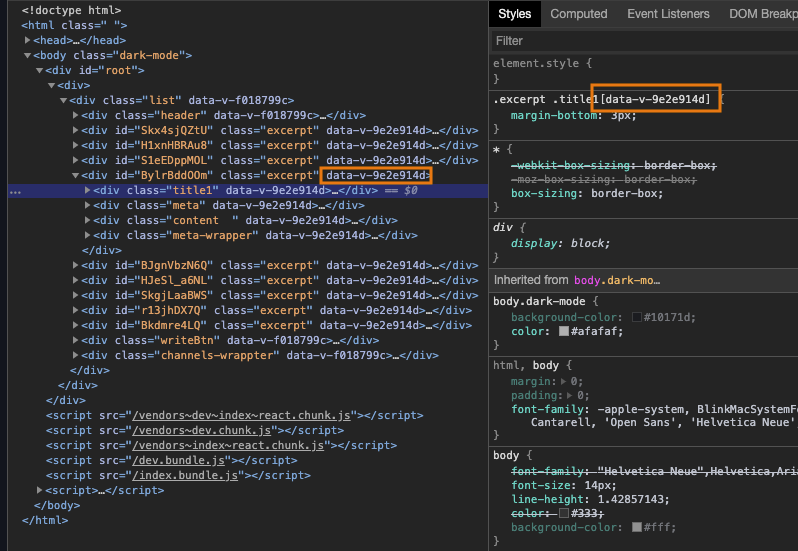

css 는 언제나 전역으로 사용되기 때문에 리액트 컴포넌트별로 css 를 사용하더라도 경우에 따라 실렉터가 충돌날 수 있다. 이를 해결하기 위한 다양한 방법이 있겠지만 이 글에서는 사용방법이 간단한 [scoped-css-loader](https://www.npmjs.com/package/scoped-css-loader) 모듈을 이용하는 방법을 소개한다.

<br>

### 사용방법

컴포넌트 파일명이 Excerpt.js 라고 하면 css 정의 파일의 파일명을 Excerpt.**_scoped_**.scss 로 하고 컴포넌트에서 import 한다.


<br>

Excerpt.scoped.scss

```scss
.excerpt {
  .title1 {
    margin-bottom: 3px;
  }
}
```

<br>

Excerpt.js

```jsx{6,7}
import React from 'react'
import './Excerpt.scoped.scss'

export default function Excerpt() {
  return (
    <div className='excerpt'>
      <div className='title1'>hello world</div>
    </div>
  )
}
```

끝~

<br>

그러면 아래와 같이 해당 컴포넌트의 dom 에는 data-v-xxx 속성이 추가되고 적용되는 실렉터에도 data-v-xxx 속성 실렉터가 자동으로 적용된다.



<br>

### 설정방법

#### 모듈 설치

```
yarn add babel-plugin-react-scoped-css --dev
yarn add scoped-css-loader --dev
```

<br>

#### webpack.config.js 설정 수정

css-loader 설정 바로 뒤에 `scoped-css-loader` 모듈을 추가한다

```js
{
  test: /\.(sc|c|sa)ss$/,
  use: [
    {
      loader: 'style-loader',
    },
    {
      loader: 'css-loader',
      options: {
        sourceMap: true,
        importLoaders: 2,
      },
    },
    // You have to put in after `css-loader` and before any `pre-precessing loader`
    { loader: 'scoped-css-loader' },
    {
      loader: 'sass-loader',
    },
  ],
},
```

<br>

#### .babelrc 수정

아래 설정을 추가한다.

```
"plugins": ["babel-plugin-react-scoped-css"]
```

바벨설정이 package.json 에 포함되어 있다면 package.json 의 babel 항목에 plugins 를 추가한다.

```json
..
  "babel": {
    "presets": [
      "react-app",
      "mobx"
    ],
    "plugins": ["babel-plugin-react-scoped-css"]
  },
..
```

<br>

### Ref.

https://www.npmjs.com/package/scoped-css-loader
