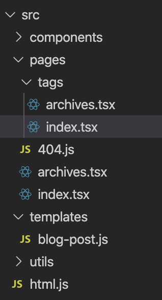
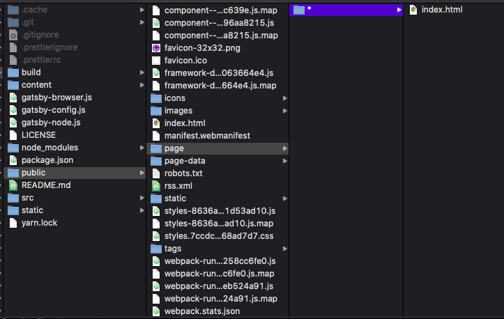

요즘 여기저기서 개츠비에 대한 칭찬이 많아서 꾸준히 관심을 가지고 있었다. [Dan Abramov](https://overreacted.io/) 의 핑크빛 블로그에 대한 인상도 좋았고 무엇보다도 리액트 기반인 만큼 필요할 때 어렵지 않게? 주물럭 거릴 수 있을 것이라 기대하고 개츠비 블로그로 이사를 결심하였다.

[이전 블로그](https://min9nim.github.io)를 만들 때만 해도 github pages 와 jekyll 기반의 블로그가 대세였던 것 같은데 몇년 사이 상황이 많이 바뀐 것 같다. jekyll 기반으로 블로그를 만들 때는 ruby 가 익숙치 않아서 무척이나 괴로왔던 기억이 있었는데 이번에 개츠비로 다시 만들었던 경험은 기대만큼 만족스러웠다.

일단 개츠비의 기본적인 블로그 보일러플레이트인 [gatsby-starter-blog](https://www.gatsbyjs.org/starters/gatsbyjs/gatsby-starter-blog/) 를 시작으로 개인적으로 사용하던 기능들을 하나둘 구현해 나갔다.

월별 포스트 목록이나, 태그기능은 어렵지 않게 구현이 되었다. 다크모드 기능은 [Dan Abramov](https://overreacted.io/) 의 블로그와 [개츠비 문서](https://www.gatsbyjs.org/blog/2019-01-31-using-react-context-api-with-gatsby/#creating-the-context-file-in-a-new-gatsby-project)를 참고했다.

그런데 조금 만만치 않았던 것이 아래 메인 페이지의 페이징 처리였다.


서버 사이드 렌더링이 지원되지 않는 정적사이트에서 페이징처리를 구현하려니 여러가지로 난감했지만 몇번의 삽질 끝에 결국 어려운 걸? 해냈다. 이번에 고생하며 알게 된 소소한 내용들에 대하여 기록을 남긴다.

개츠비는 `src/pages` 폴더 안에 포함된 폴더 및 파일들의 네이밍을 기준으로 기본 라우팅이 이루어진다. 이 부분은 [Nextjs](https://nextjs.org/) 와 비슷하다.



페이징 처리를 위해 추가할 라우팅은 아래와 같다. 그리고 각 화면은 모두 `pages/index.tsx` 화면을 사용을 해야 하며 URL 경로에 따라 단지 데이터만 다르게 렌더링 되어야 한다.

- `/` : 첫번째 페이지 목록
- `/page/2` : 두번째 페이지 목록
- `/page/3` : 세번째 페이지 목록
- ...

이를 구현하기 위해서 gatsby-node.js 파일에서 아래와 같이 설정을 추가한다. gatsby-node.js 는 빌드타임에 실행이 되는 파일이기 때문에 해당 파일의 변경 결과를 확인하려면 변경 때마다 빌드를 다시 수행해야 한다. (개발모드의 HMR 대상이 아님)

```jsx{3-9}
exports.onCreateNode = ({node, actions, getNode}) => {
  const {createNodeField, createPage} = actions
  if (node.path === '/') {
    createPage({
      path: '/page/*',
      matchPath: '/page/:id',
      component: path.resolve('src/pages/index.tsx'),
    })
  }
  if (node.internal.type === `MarkdownRemark`) {
    const value = createFilePath({node, getNode})
    createNodeField({
      name: `slug`,
      node,
      value,
    })
  }
}
```

`onCreateNode` 함수는 개츠비 빌드 타임에 특정 라우팅 경로 의 페이지 빌드가 완료된 이후에 호출되는 일종의 hook 이다. 위와 같이 코드를 추가하면 `/` 라우팅 페이지(즉 메인페이지)의 빌드가 끝난 이후에 `page/*` 라우팅 경로 에 대한 페이지 빌드가 시작된다.

해당 라우팅 경로(`/page/:id`) 에 대한 빌드가 완료되면 아래와 같이 `page/*` 폴더가 생성된다.



여기서 `/public/index.html` 과 `/public/page/*/index.html` 파일의 내용은 결국 동일한 파일이지 않을까 싶어서 비교해 보았는데 동일한 파일은 아니었다. 더 자세한 것은 잘 모르겠다.

어째튼 이제 `/page/:id` 라우팅 경로로 접근하는 모든 요청에는 `pages/*/index.html` 이 응답되게 된다.

> Note) 개츠비의 동적 라우팅은 클라이언트 사이드 라우팅시에만 정상 동작한다. production 환경에서 `~/page/2` 와 같이 URL로 직접 접근할 때는 404 오류가 발생한다. 새로고침시에도 마찬가지로 오류가 발생한다. (단, 로컬 개발환경에서는 서버사이드 라우팅시에도 정상동작함)

\* 블로그 저장소: https://github.com/min9nim/gatsby-blog

<br>
<br>

기타) 개츠비의 특징

- 개발모드와 달리 production 에서는 기본적으로 무한스크롤이 지원된다.
  - 처음에는 이걸 모르고 어떻게 구현한 것일까 무척이나 고심했었다 😪
  - ex) https://keating.now.sh/archives
- PWA 기본 지원 👍
- 개발모드(`gatsby develop`)에서 HMR 지원 😀
