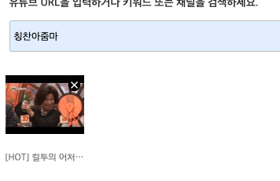

일반적으로 텍스트의 양이 많아서 주어진 영역을 벗어나면 아래와 같이 표시된다.


```html
<ul class="images">
  <li>
    <div class="fileItem" style="width: 100px; height: 100px;">
      <button
        type="button"
        class="button button-4 delete"
      ></button>
    </div>
    <span class="image-name"
      >[HOT] 컬투의 어처구니 - SNS 화제의 &amp;#39;폭탄주 아줌마&amp;#39;의 화끈한 폭탄제조 솜씨!
      20140410</span
    >
  </li>
</ul>
```

주어진 영역을 벗어나는 텍스트를 잘라내기 위해 스크립트를 이용하는 것도 가능하다. 하지만 **해당 영역의 너비가 달라져서 뿌려줘야 할 텍스트의 길이가 늘어나거나 줄어들 경우 스크립트를 다시 수정해야하는 불편함**이 있을 수 있다. (해당 영역만 알맞게 차지할 텍스트의 길이를 세어보는 것도 귀찮은 일이다😤)

따라서 css 를 이용한 처리를 권장한다. 이렇게 한다 😊

```css
.image-name {
  text-overflow: ellipsis;
  overflow: hidden;
  width: 100px;
  white-space: nowrap;
  display: inline-block;
}
```

짜잔!



<br>

### Ref.

https://junistory.blogspot.com/2017/06/css-ellipsis.html
