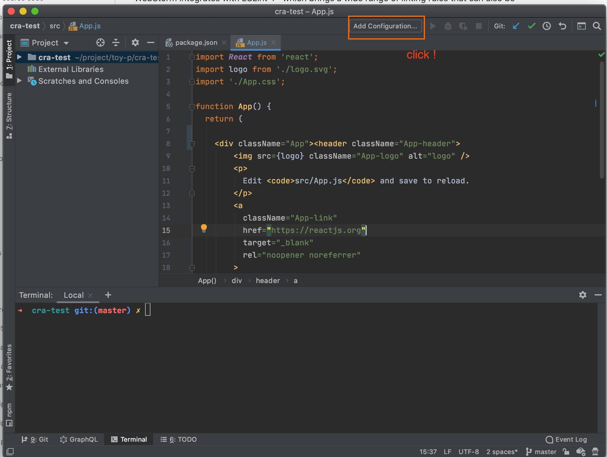
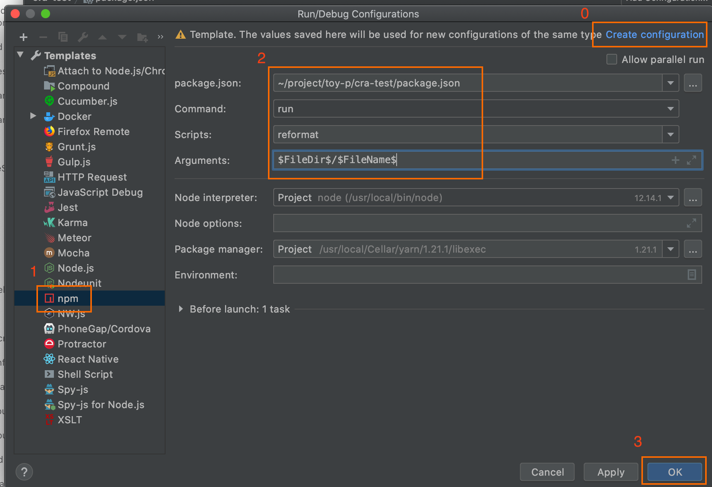
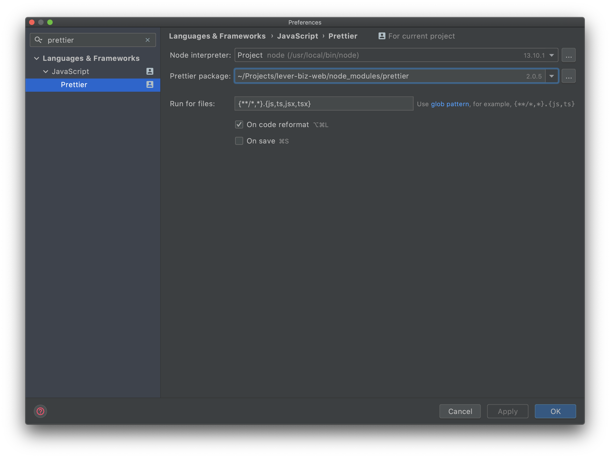

CRA 프로젝트에서 커밋 전 자동포매팅을 설정하는 방법과 현재 열린파일에 대해 포매팅을 적용하는 방법을 공유한다.

### 커밋 전에 자동포매팅 적용

1. 관련 모듈 설치

```
yarn add -D husky lint-staged prettier
```

2. package.json 에 설정 추가

```json{4-13}
  "dependencies": {
    // ...
  },
  "lint-staged": {
    "src/**/*.{js,jsx,ts,tsx,json,css,scss,md}": [
      "prettier --write"
    ]
  },
  "husky": {
    "hooks": {
      "pre-commit": "lint-staged"
    }
  },
```

3. .prettierrc 설정 추가

프로젝트 루트에 포매팅 설정을 추가. `{프로젝트루트}/.prettierrc`

```js
{
  "printWidth": 80,
  "semi": false,
  "singleQuote": true,
  "trailingComma": "all",
  "arrowParens": "avoid"
}
```

이제 커밋을 할 때 자동으로 prettier 가 해당 파일들에 대한 포매팅을 수행한다. 😁

<br>

### 현재 열린 파일에 대한 포매팅

코드 수정 중에 혹은 커밋 전에 포매팅된 상태로 작업해 둔 코드를 확인하고 싶을 때가 있을 수 있다. 이럴 경우에는 어떻게 해야할까? 특정 파일에 대한 포매팅은 터미널에서 간단히 아래 명령으로 처리할 수 있다.

```
node_modules/.bin/prettier --write {대상파일}
```

하지만 이는 터미널을 열고 입력해야 하는 불편함이 있다.

다행히? 웹스톰의 명령 실행 설정을 통해 이를 보다 간편하게 사용하는 것이 가능하다. 클릭 한번으로 현재 열린 파일에 대한 포매팅을 수행하는 방법은 아래와 같다.

1. package.json 에 스크립트(`reformat`) 추가

```json{3}
"scripts": {
  // ...
  "reformat": "prettier --write"
}
```

<br>

2. `add configuration` 클릭
   

<br>

3. reformat 명령 설정
   

<br>

4. done
   

<br>

또는, prettier 설정에 단축키 설정도 가능

   

### Ref.

https://create-react-app.dev/docs/setting-up-your-editor/#formatting-code-automatically
