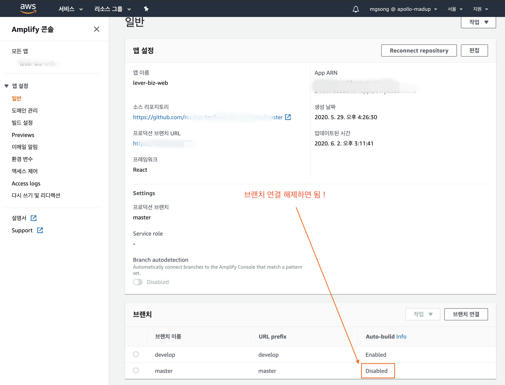
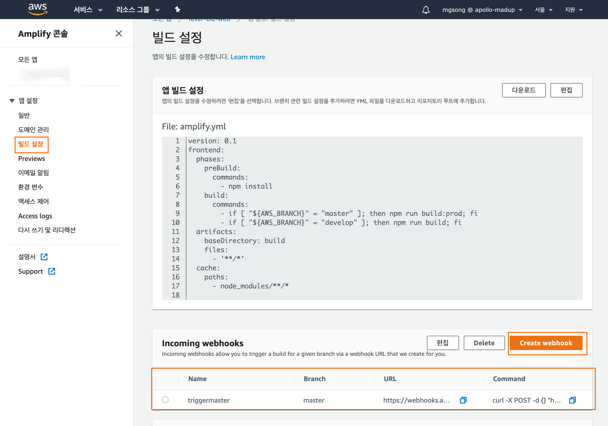

GitHub의 특정 레포지토리(애플리케이션)를 AWS Amplify 에 등록한 후 **특정 브랜치를 연결 설정 하면 해당 브랜치에 코드가 푸시될 때 자동으로 배포가 수행**된다.

하지만 master 브랜치는 일반적으로 실 운영환경으로서 관리되기 때문에 코드 푸시보다는 태그생성시에 배포하는 것이 더욱 적절하다. AWS Amplify 의 웹훅과 GitHub 액션을 이용해 GitHub 레포지토리 태그 생성시 자동으로 master 브랜치 배포가 이루어지도록 설정하는 방법을 정리해 본다.

### 1. master 브랜치의 연결설정 해제

(이미 연결이 끊어진 상태라면 skip 한다)


<br>

### 2. master 브랜치의 웹훅 설정



<br>

### 3. GitHub 액션을 이용해 웹훅 호출

프로젝트에 `{프로젝트루트}/.github/workflows/on-release.yml` 파일을 추가한다.

```yml
name: on release

on:
  release:
    types: [created]

jobs:
  amplify-webhook:
    runs-on: ubuntu-latest
    steps:
      - uses: actions/checkout@v2
      - run: curl -X POST -d {} "위에서생성한웹훅경로" -H "Content-Type:application/json"
```
