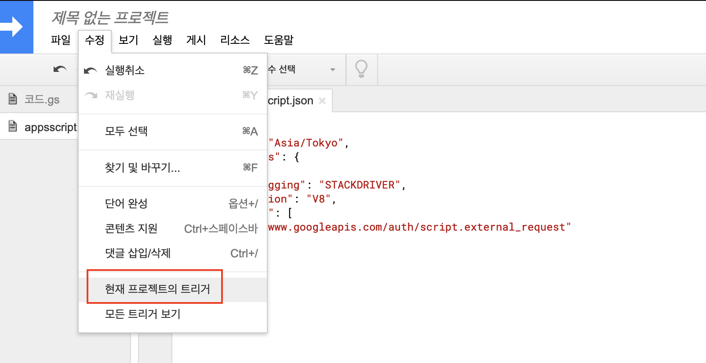

요즘 시장 조사 및 서비스 만족도 조사등을 위해 구글 설문지 폼을 많이 사용합니다. 구글 폼을 이용하면 손쉽게 설문양식을 생성할 수 있고 배포할 수 있으며 실시간으로 취합된 응답결과를 확인할 수 있어 편리합니다.

하지만 많은 경우에 설문 결과를 취합하는 것만으로 일이 끝나지는 않습니다. 설문조사를 시작했다면 설문 이후 해당 결과들을 토대로 다양한 이후 처리 작업들이 기다리고 있겠죠. 이 때 취합되는 설문 제출 결과들을 엑셀이 아니라 데이터베이스에 바로 저장할 수 있다면 이를 이용한 자동화 시스템을 보다 수월하게 구축할 수 있을 것입니다.

이 글에서는 특별히 구글 설문지 양식이 제출될 때의 이벤트를 이용해 설문지 응답결과를 api 호출을 통해 DB에 자동으로 적재하는 방법에 대해 소개합니다.

<br>

### Google Apps Script
제가 소개하고자 하는 내용은 사실 [Google Apps Script](https://developers.google.com/apps-script) (이하 `구글스크립트`) 라는 도구의 아주 작은 일부 사용 사례일 뿐입니다. 구글스크립트 를 이용하면 구글설문지 뿐만 아니라 모든 구글문서 도구의 반복적인 작업들을 자동화할 수 있습니다.

본 글에서는 특별히 구글 설문지 양식의 제출 이벤트를 처리하는 방법에 대해서만 집중하여 소개하고자 합니다.

사용하실 구글 설문지와 설문응답을 전송받을 API가 준비되었다면 지금 바로 아래 가이드를 따라 진행해 볼 수 있습니다.

<br>

### 사전 준비사항
- 구글 설문지
- 호출 가능한 RESTful API 엔드포인트

<br>

### 1. 설문지에 스크립트 추가하기
설문지 관리 화면에서 `스크립트 편집기` 메뉴를 선택합니다


### 2. 스크립트 코드 삽입
아래 코드를 삽입하고 저장 버튼을 클릭합니다.

```js
function onSubmit(e) {
  const items = e.response.getItemResponses()
  const results = items.map(item => ({
    id: item.getItem().getId(),
    type: item.getItem().getType(),
    title: item.getItem().getTitle(),
    response: item.getResponse(),
  }))
  UrlFetchApp.fetch('https://echo-api.vercel.app/api', {
    method: 'POST',
    headers: {
      'Content-Type': 'application/json',
    },
    payload: JSON.stringify({
      formId: e.source.getId(),
      formTitle: e.source.getTitle(),
      email: e.response.getRespondentEmail(), // 이메일 주소 수집 설정 체크한 경우
      results: results,
    }),
  })
}
```


### 3. 권한파일 추가
`보기` 메뉴에서 `메니페스트 파일 표시` 선택


아래 `oauthScopes` 설정을 추가 후 저장

```json{7-9}
{
  "timeZone": "Asia/Tokyo",
  "dependencies": {
  },
  "exceptionLogging": "STACKDRIVER",
  "runtimeVersion": "V8",
  "oauthScopes": [
     "https://www.googleapis.com/auth/script.external_request"
   ]
}
```

### 4. 트리거 설정

`수정` 메뉴에서 `현재 프로젝트의 트리거` 선택



### 5. 스크립트 사용 권한 승인

계정을 선택하여 권한을 부여합니다.


### 완료
해당 스크립트에 트리거가 설정된 것을 확인할 수 있습니다.


### 테스트
다음과 같은 응답 작성 후 제출을 하면,


사전 세팅된 API로 전송되는 결과는 아래와 같습니다.


Note)
혹 첨부파일이 있었다면 해당 파일은 구글드라이브로 먼저 업로드가 되고 해당 링크만 전송을 받게 됩니다.
