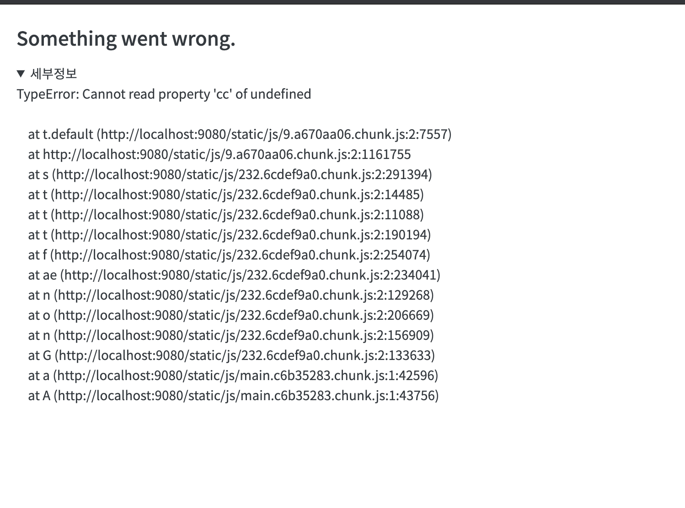

리액트는 렌더링시 오류가 발생할 경우 오류가 발생했던 일부 컴포넌트만 렌더링을 하지 않는 것이 아니라 전체 화면 모두를 아예 렌더링하지 않는다. 잘못된 화면을 사용자에게 보여주는 것보다는 아예 보여주지 않는 것이 더 나은 사용자경험이라는 판단에서이다.

이것은 리액트가 화면을 렌더링할 때 오류를 만나면 아무것도 그리지 않기 때문에 사용자는 그저 흰화면을 보게 된다는 의미이다. 

물론 시스템의 오류가 없도록 서비스를 개발하고 운영하는 것이 가장 아름다운 일이겠지만 동적 타입언어(JavaScript)의 특성 상 런타임 오류를 100% 발생하지 않음을 보장하기란 현실적으로 불가능에 가깝다고 필자는 생각한다.

예기치 못한 오류가 발생할 경우에 대한 대비책으로서 적어도 흰화면보다는 준비된 시스템 장애 화면을 보여주는 것이 조금 더 나은 UX임에는 분명하다.

<br>

이렇게 시스템 장애 화면을 따로 정의하여 보여주고자 한다면, 아래 `ErrorBoundary` 컴포넌트를 이용할 수 있다.

`ErrorBoundary` 는 클래스 컴포넌트의 `componentDidCatch` 생명주기 함수를 이용하여 아래와 같이 작성할 수 있다.

### ErrorBoundary.js

```js
import React from 'react'

export default class ErrorBoundary extends React.Component {
  constructor(props) {
    super(props)
    this.state = { error: null, errorInfo: null }
  }

  componentDidCatch(error, errorInfo) {
    this.setState({
      error: error,
      errorInfo: errorInfo,
    })
  }

  render() {
    const ErrorScreen = this.props.fallback || DefaultErrorScreen
    if (this.state.errorInfo) {
      return <ErrorScreen error={this.state.error} errorInfo={this.state.errorInfo} />
    }
    return this.props.children
  }
}

function DefaultErrorScreen({ error, errorInfo }) {
  return (
    <div style={{ padding: 20 }}>
      <h2>Something went wrong.</h2>
      <details style={{ whiteSpace: 'pre-wrap' }}>
        {error && error.toString()}
        <br />
        {errorInfo.componentStack}
      </details>
    </div>
  )
}
``` 

### 적용방법
```js
ReactDOM.render(
  <ErrorBoundary>
    <App />
  </ErrorBoundary>,
  document.getElementById('root')
);
```

### 오류 발생 시 결과화면




<br>

### Ref
https://ko.reactjs.org/blog/2017/07/26/error-handling-in-react-16.html
