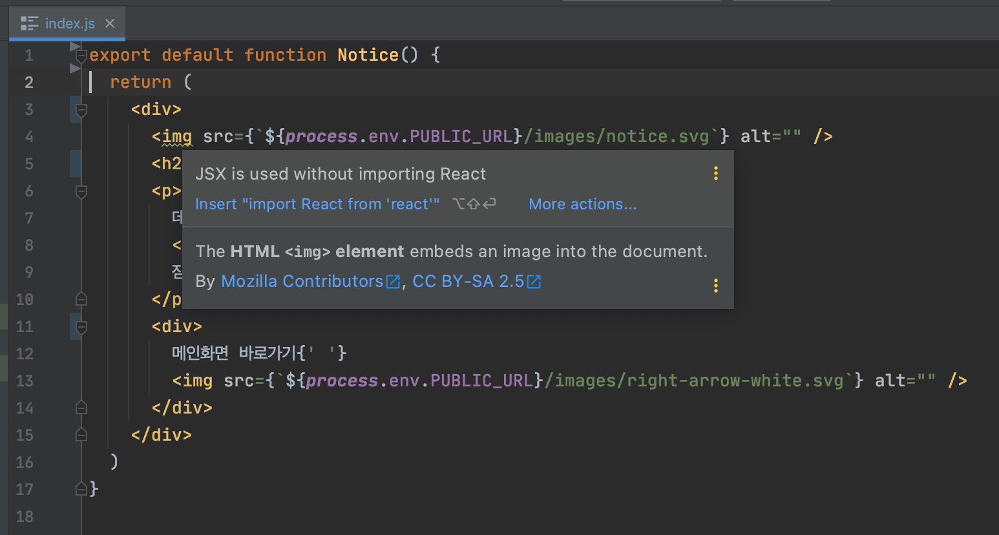
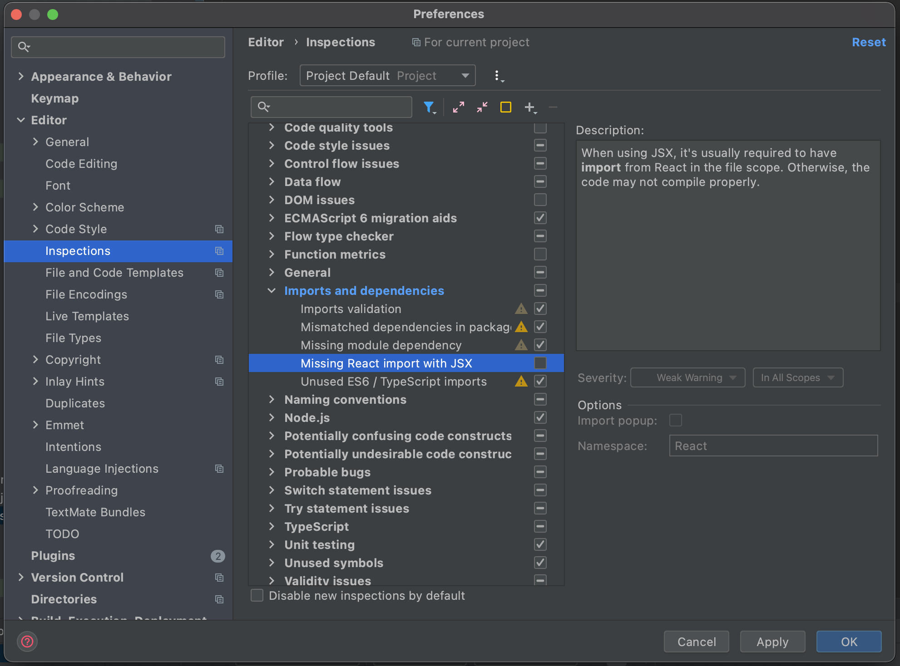
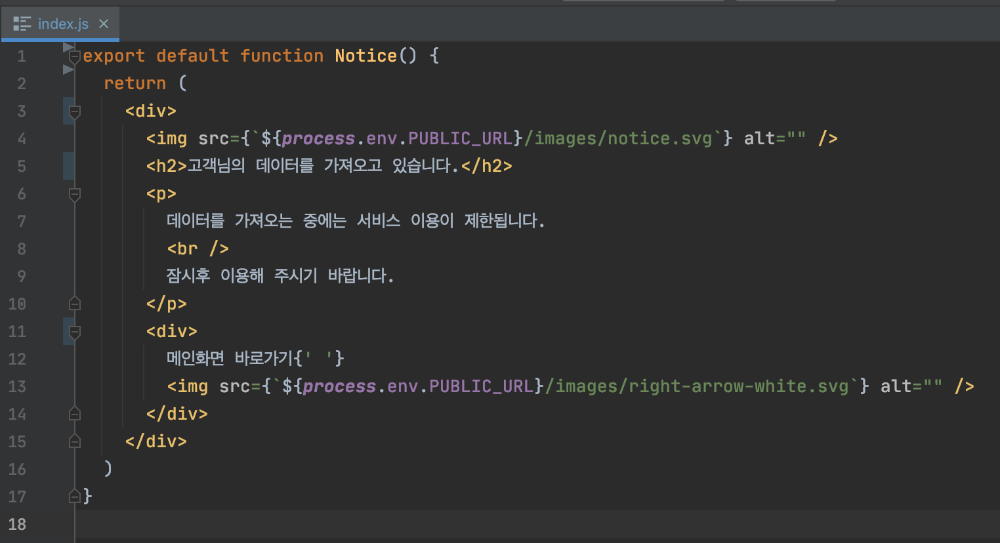

CRA4.0 부터는 jsx 를 사용할 때 `import React from 'react'` 를 더이상 사용하지 않아도 된다. https://ko.reactjs.org/blog/2020/09/22/introducing-the-new-jsx-transform.html

별 것 아닌 것 같지만 그동안 신규 컴포넌트 작성시마다 해당 `import` 구문을 삽입하는 것은 참 귀찮은 일이었기에 무척 반가운 소식이었다.

하지만 해당 구문을 지웠을 때 유독 img 태그 사용시 웹스톰에서 예민하게 경고메세지를 띄어주었다.

강박증 때문인가. 나는 이런 사소한 오류 하나 그냥 모른척할 수가 없다.

나와 같은 심적고통을 느끼시는 분이 있다면 아래와 같이 inspection 설정에서 `Missing React import with JSX` 옵션을 꺼주자.

짜잔!

이렇게 마음의 평안을 얻는다. 
# 🧘

 

### Ref.
https://youtrack.jetbrains.com/issue/WEB-47599
