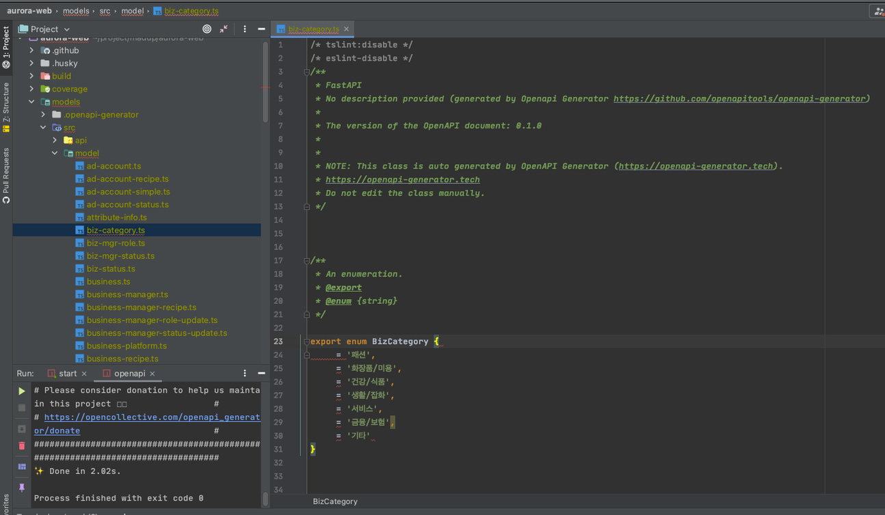

## RESTful API 를 이용하는 프론트엔드 개발의 어려움
JavaScript 의 런타임에러가 프론트엔드 개발자들을 오랫동안 괴롭혀 온 것 같이, RESTful API 의 잘못된 사용으로 인한 런타임 오류는 프론트엔드 개발자들의 오랜 골칫거리였습니다. 어쩌면 여전히 많은 개발팀들이 가지고 있는 문제일지도 모르겠습니다.

특별히 API 의 잘못된 사용으로 인한 문제는 기본적으로 프론트엔드 개발자와 백엔드 개발자 사이의 정확하지 않은 커뮤니케이션으로 발생하는 문제로서 백엔드나 프론트엔드의 어떤 로직의 문제가 아니라 단순히 백엔드에서 원하고 기대했던 대로 프론트에서 데이터들을 전달하지 않았거나 프론트에서 원하고 기대하는 대로 백엔드가 데이터를 리턴해 주지 않을때 발생하는 문제입니다. 이 문제는 서로 간의 추가적인 대화와 협의과정을 발생시키며 개발 비용의 상당 부분을 차지하게 됩니다.  

<br/>
<br/>

## API 앞에 선 TypeScript 의 무력감
그래도 우리에겐 TypeScript 가 있어서 다행입니다. TypeScript 를 이용해 API 의 스펙을 한땀 한땀 타입으로 정의해 두면 API 의 오사용을 많이 막을 수 있을 것입니다. 하지만 시간이 지나면 이마저도 여전히 녹록치 않게 됩니다. 처음에 준비된 API 가 10개 내외 정도라면 별로 문제가 되지 않을 것입니다. 하지만 슬슬 애플리케이션의 규모가 커지고 사용하는 API 들이 수십가지가 넘어가게 되면, 수많은 API 들의 입력과 출력을 한꺼번에 정의하는 것은 여간 귀찮고 힘든 일이 아닐 수 없습니다. 게다가 API 들의 스펙은 우리들의 바램과 달리 비즈니스 요건에 따라 잦은 변경이 발생하게 되며, 이를 정확하게 추적해 가며 일일이 해당 타입들을 재정의 하는 것은 거의 불가능에 가까운 일이 아닐 수 없습니다. 이런 상황 속에서 여러분들은 지금까지 어떻게 대응을 하고 있었나요? 수시로 변경되는 API 인터페이스 앞에서 떠나가는 버스를 바라보듯 그냥 `any`  타입을 남발하며 손놓고 지내고 있지는 않으셨는지요? 


<br/>
<br/>


## GraphQL 의 등장
GraphQL 은 바로 위와 같은 문제에 대한 근본적인 대안으로 등장하게 되었습니다. 위와 같은 문제로 고민하던 개발자들이 혹시 GraphQL 도입을 결정하고 GraphQL을 경험해 본다면 마치 천국 문이 열린 것 처럼 커다란 황홀함을 느끼게 될 것입니다. 그것은 마치 JavaScript 의 시도 때도 없이 터지는 런타임 에러에 회의감을 느끼던 개발자가 TypeScript 를 만나고 느끼는 희열과 비슷하다고 할 수 있을 것 같습니다.

사실 TypeScript 와 GraphQL 이 해결하는 문제는 비슷합니다. TypeScript 가 타입이 없는 JavaScript 에 정적 타이핑이라는 옷을 입게 해주는 것 같이, GraphQL 은 타입이 없는 API 가 강력한 타입 옷을 입게 해줍니다.


(이미지출처: University of Arizona/Heather Roper)

<br/>
<br/>


## 무시할 수 없는 GraphQL의 진입장벽
요즘 개발 커뮤니티를 바라보면 프론트엔드 개발에서 TypeScript 의 위상은 지속적으로 견고해 지고 있는 것 같습니다. 하지만 GraphQL 의 성장세는 기대보다는 조금 더딘 것 같습니다. 그것은 아무래도 GraphQL 의 도입을 위한 진입장벽과 학습장벽이 제법 높기 때문이지 않을까요. 그것은 GraphQL 자체의 학습장벽 뿐만 아니라 GraphQL 의 도입은 개인이 홀로 할 수 있는 것이라기 보다 프론트엔드와 백엔드 개발자 사이의 그리고 여러 이해당사자들 간의 공감대와 협의가 필요하기 때문일 것입니다.


(이미지출처: https://brunch.co.kr/@realdude/12)


<br/>
<br/>


## 또 다른 대안으로서 Swagger 와  OpenAPI Generator
이제야 제가 이 글을 쓰게 된 진짜 이유를 말할 때가 된 것 같습니다. GraphQL은 강력하지만 저는 GraphQL 을 소개하고 도입을 권장하기 위해 이 글을 시작한 것이 아닙니다. 앞서 이야기 드린 데로 현재 GraphQL을 사용하고 있지 않은 팀으로서 GraphQL을 갑자기 도입한다는 것이 얼마나 큰 비용과 리스크가 예상될 지를 잘 알고 있습니다. 이 글을 쓰는 진짜 목적은 RESTful API 를 기반으로 프로젝트를 진행하고 있는 개발팀에게 GraphQL 로의 전향적인 전환이 아니더라도 다소 진입장벽이 낮은 또 다른 대안이 있음을 공유하기 위함입니다.

그것은 **바로 Swagger 와 OpenAPI Generator** 의 도입인데요. 이제부터 Swagger 와 OpenAPI Generator 가 무엇인지 간단히 소개하고 프론트엔드에서 OpenAPI Generator 를 이용하여 API 의 인터페이스(타입)을 자동으로 생성하는 방법을 알아보고자 합니다. (백엔드에서 Swagger 를 설정하는 내용은 포함되지 않습니다.)


<br/>
<br/>

## Swagger 와 OpenAPI Generator
Swagger 는 RESTful API 를 보다 편리하고 쉽게 그리고 일관되게 설계하고 개발하는 표준을 제안하고 관련된 자동화 도구들을 제공하는 오픈소스 프로젝트입니다. Swagger 에서 제안하는 RESTful API 표준을 OpenAPI Specification 라고 하고요 줄여서 OAS 라고 부릅니다. OAS 는  다양한 언어와 환경에서 사람과 컴퓨터가 모두 이해하기 쉬운 RESTful API 의 표준 인터페이스를 제안합니다. 

그리고 Swagger 는 OAS 규격에 따라 API 를 개발하고 또 API 문서를 자동으로 생성하는 여러가지 도구들을 제공합니다.

OpenAPI Generator 는 Swagger 에서 제공하는 여러가지 자동화 도구들 중 하나입니다. OpenAPI Generator 는 OAS 에 따라 개발된 RESTful API 스펙을 기반으로 클라이언트에서 사용가능한 타입들을 자동으로 생성해 주는 도구입니다. 

OAS 의 철학에 따라 OpenAPI Generator 도 다양한 언어와 환경을 모두 지원하지만. 본 문서에서는 특별히 프론트엔드 프로젝트에서 타입스크립트를 사용하는 경우에 한해서 Swagger 에서 제공하는 API 의 타입들을 자동 생성하는 방법에 대하여 간단하게  소개하고자 합니다.


<br/>
<br/>


## OpenAPI Generator 세팅

### openapi-generator-cli 설치
```shell
npm install @openapitools/openapi-generator-cli -D
```
OpenAPI Generator 를 설치하는 다양한 방법이 있지만 특별히 npm 을 통한 설치는 위와 같습니다. Homebrew 나 docker 를 이용한 설치는 아래 링크를 참고해 주세요.

[https://openapi-generator.tech/docs/installation](https://openapi-generator.tech/docs/installation) 

<br/>

### openapi.json
프로젝트 루트에 openapi.json 파일을 추가합니다.
```json
{
  "modelPackage": "src/model",
  "apiPackage": "src/api",
  "withSeparateModelsAndApi": true
}
```

<br/>

### 명령어 추가
package.json 파일에 API 모델을 생성하는 스크립트를 추가합니다. (해당 명령의 옵션은 API 문서의 위치와 request 모듈의 종류 등에 따라서 변경될 수 있습니다.)

```json{3}
"scripts":{
  ...,
  "openapi": "openapi-generator generate -i https://dev.yourapiserver.com/openapi.json -g typescript-axios -o ./models -c ./openapi.json --skip-validate-spec"
}
```
이제 모든 준비가 끝났습니다. 참 쉽죠잉~

 <br/>

### 자동 생성된 결과물
이제 `yarn openapi` 명령을 수행하면 `/models` 폴더에 API 의 모델들이 아래와 같이 자동으로 생성됩니다. `/models` 폴더가 자동으로 생성되는 폴더인 만큼 `.gitignore` 파일에 `/models` 경로를 추가해 주는 것 또한 필요할 것 입니다. 필자는 해당 타입들(`/models/src/model`)이 생성되면 `/src/model` 경로로 자동복사가 되도록 설정하여 필요한 부분만 실제 코드에서 참조하여 사용을 하고 있습니다.
  


그리고 `api` 폴더에는 axios 기반의 API 별 호출함수 또한 자동으로 생성이 되는데요. 참고로 저는 개인적으로 이 부분은 프로젝트에서 그대로 사용하기에는 적합하지 않아서 직접 사용을 하고 있지는 않습니다.


반면 자동으로 생성된 API 의 입력 및 출력 타입들을 아래와 같이 API 정의 시, 혹은 다른 필요한 곳에서 적절히 가져다 사용을 하고 있습니다.


<br/>

### 주의사항
혹시 백엔드에서 enum 타입 정의시 한글을 사용할 경우 아래와 같이 생성된 모델에 오류가 있을 수 있으므로 주의가 필요합니다.



<br/>
<br/>

## 결론
프론트엔드에서 TypeScript 를 사용하고 있지만, 아직 Swagger 와 OpenAPI Generator 를 사용하고 있지 않다면 꼭 한번 사용해 보시기를 권장합니다. GraphQL 만큼 강력하지는 않더라도 Swagger 는 프론트엔드와 백엔드 개발자 사이의 API 스펙에 대한 커뮤니케이션을 매우 생산적이고 효과적으로 만들어 줄 것입니다. 그리고 OpenAPI Generator 를 이용해 모든 API 의 입출력 타입을 자동생성한다면 API 의 변경을 빠르게 확인하고 프론트에서 API 오사용으로 인한 문제들을 획기적으로 줄여줄 수 있을 것 입니다. 


<br/>
<br/>


## 참고자료
- [https://swagger.io/about/](https://swagger.io/about/)
- [https://openapi-generator.tech/](https://swagger.io/about/) 

<br/>
<br/>

\* *[매드업의 테크블로그에 함께 게시된 글](https://tech.madup.com/openapi-generator/)입니다.*
