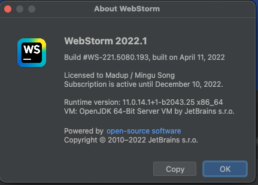

혹시 버젼 업그레이드하고 이상한 문제 터질까봐, 미루고 미루던 macOS Monterey 업데이트를 마쳤다. 별 문제가 없나 싶었는데.. 웹스톰에서 문제가 터졌다.

일단 웹스톰에서 명령어 설정하는 곳에서 프로젝트, node interpreter, 그리고 npm 패키지 매니져 경로를 제대로 인식하지 못했다. 이 부분은 어째튼 수동으로라도 경로 찾아서 매핑을 해주었다.

그런데.. 제대로 고생하고 있는 부분은 husky 의 pre-commit 에서 아래와 같은 오류가 발생하고 있다.
 
```
12:37:47.518: [aurora-web] git -c core.quotepath=false -c log.showSignature=false add --ignore-errors -A -f -- src/views/utilities/components/date-range-picker-doc.tsx src/menu-items/utilities.js src/routes/MainRoutes.js
12:37:47.537: [aurora-web] git -c core.quotepath=false -c log.showSignature=false commit -F /private/var/folders/tn/t1m35t0n3bs770lfxjyryxjc0000gn/T/git-commit-msg-1.txt --
.husky/pre-commit: line 4: yarn: command not found
husky - pre-commit hook exited with code 127 (error)
```

pre-commit 수행시 yarn 경로를 못 찾고 있는 것이다ㅠ

./husky/pre-commit
```
#!/bin/sh
. "$(dirname "$0")/_/husky.sh"

yarn lint-staged
```

<br/>

## 기타
- yarn 뿐만이 아니라 project 루트 경로 및 git 의 실행파일 위치도 웹스톰이 제대로 인식을 못하는 문제 있음


## done 🎉
어떤 관계가 있는 것인지는 모르겠지만, 웹스톰을 아래 최신 버젼으로 업그레이드하고서 해결됨.

